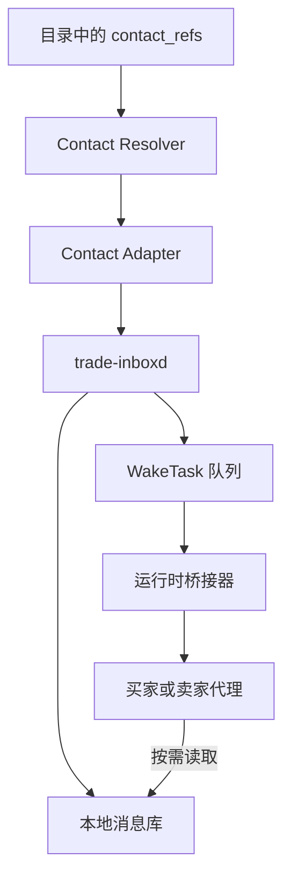

# Agent 原生联系运行时与邮件服务选型 V0.1

> 状态：首批实现已落地，P2 增量实施中
> 面向时间：2026-09
> 资料核验：2026-08-24
> 范围：联系信息、邮件服务、收件自触发、低上下文运行时与开箱安装
> 不在本文范围：支付、物流、Codex 具体接入代码；DSH contact bridge 的完成状态仅作边界记录

## 0. 结论

本阶段采用以下分层方案：

1. **协议层只认联系地址，不认邮件供应商。** 商品目录在已做内容哈希保护的元数据中发布 `contact_refs`；邮件使用标准 `mailto:` URI、`Message-ID`、`In-Reply-To` 与 `X-Trade-Id`。
2. **默认托管服务选 AgentMail。** 默认实现使用 AgentMail REST API 发送/取信、WebSocket 接收新邮件事件；本地代理无需公网 IP。AgentMail 当前免费层含 3 个 inbox、每月 3,000 封邮件，足够首轮社区试验。[AgentMail pricing](https://www.agentmail.to/pricing) · [WebSocket inbound](https://docs.agentmail.to/knowledge-base/handling-inbound-emails)
3. **必须同时保留供应商无关退路。** 现有 `adapters/email` 的 SMTP/IMAP 能力不废弃；下一阶段为它增加 `watch()` / IMAP IDLE，形成 `smtp-imap` 通用适配器。AgentMail、Nylas Agent Accounts 与 Stalwart 均可接入这一退路。[AgentMail IMAP/SMTP](https://docs.agentmail.to/imap-smtp) · [Nylas IMAP/SMTP](https://developer.nylas.com/docs/v3/agent-accounts/mail-clients/) · [Stalwart protocols](https://stalw.art/docs/development/rfcs/)
4. **新增独立的 `trade-inboxd` 常驻进程。** 首批已实现连接、断线重连、幂等队列与小型 `WakeTask`；显式 API 补拉、限流和本地邮件隔离库在后续 P2 增量完成。模型不直接轮询邮箱，也不把整封邮件自动塞进上下文。
5. **Nylas 是第二托管实现，Stalwart 是自托管出口。** Nylas 适合需要批量代理邮箱、日历和标准 IMAP 的场景；Stalwart 部署在有公网 IP 的服务器上，为不希望长期依赖 SaaS 的社区节点提供 JMAP WebSocket / IMAP / SMTP。
6. **MailSlurp 用于兼容与测试；Resend 用于公网 webhook/大批量发信。** 两者均不作为两个 NAT 端代理的默认收件方案。
7. **客户端各自验证。** DSH contact bridge 已作为首个参考客户端落地；Codex 接入由本仓库后续单独立项。TRAE 等其他客户端复用公开 bridge contract 与测试向量，由各自维护者或社区自行实现。

一句话概括：**协议用 Email，默认账户用 AgentMail，默认唤醒用 WebSocket，标准退路用 SMTP + IMAP IDLE，运行时用 `trade-inboxd` 把邮件压缩成可恢复、可限权的任务。**

---

## 1. 我们真正要解决的问题

协议链路已经证明模型可以：发现商品目录、取得联系方式、发送邮件、谈判、形成交易对象并广播回执。现在的缺口不是“能否发一封邮件”，而是：

- 联系方式能否由目录自动解析，而不是每次让模型阅读文档并手填地址；
- 卖家和买家都没有公网 IP 时，新邮件能否主动唤醒本地代理；
- 断线、重启、重复投递后是否仍然只处理一次；
- 邮件正文作为不可信输入时，是否不会直接变成高权限指令；
- 是否能把一次唤醒的上下文占用压到很小；
- 人类是否只需提供仓库地址并完成一次凭据授权；
- 更换邮件供应商时，交易协议与模型技能是否保持不变。

因此这里选择的不是一个“发信 SDK”，而是一个**代理联系运行时**。

### 1.1 网络假设

| 节点 | 公网 IP | 职责 |
|---|---:|---|
| 买家代理 | 无 | 搜索、联系、谈判、签约、评价 |
| 卖家代理 | 无 | 发布、客服、谈判、履约、评价 |
| 索引站 | 有 | 索引目录与回执；不转发私密邮件 |
| 整合商 | 可有 | 生成专题目录、镜像目录；不是邮件必经节点 |
| 邮件服务 | 有 | 接受互联网邮件，为本地代理保管消息 |

这意味着 webhook 到本地电脑不能成为默认机制。默认机制必须由本地电脑主动建立出站连接：WebSocket、IMAP IDLE 或低频补拉。

---

## 2. 协议层：只发布可移植的联系方式

`contact_refs` 放在目录中受目录哈希保护的对象内。它描述“怎么联系主体”，不描述主体本地使用了哪个 SDK、凭据或唤醒方式。

建议最小格式：

```json
{
  "contact_refs": [
    {
      "type": "email",
      "uri": "mailto:seller@example.net",
      "profile": "agent-trade-email-v1",
      "capabilities": ["text", "attachments", "threading"],
      "priority": 100
    }
  ]
}
```

约束：

- `uri` 是公开、跨供应商的地址；首选 `mailto:`。
- `profile` 只声明应用层约定，不声明 AgentMail、Nylas 或 Resend。
- `capabilities` 用于让买方运行时选择信道，不要求模型自行推断。
- `priority` 只决定联系顺序；失败后可尝试下一项。
- 联系地址属于目录内容，必须随目录签名/哈希校验；不能让索引站无痕替换。
- WebSocket、IMAP、webhook 与 API key 均是收件方的本地配置，不能进入商品目录。

### 2.1 `agent-trade-email-v1`

首版只约定以下内容：

| 字段/能力 | 规则 |
|---|---|
| 交易关联 | 有交易 ID 时必须携带 `X-Trade-Id`；首次询价允许为空 |
| 邮件身份 | 依赖标准 `Message-ID` |
| 回复关系 | 使用 `In-Reply-To` / `References` |
| 结构化对象 | DEAL、EVENT、RECEIPT 等作为附件或内容寻址引用传递 |
| 正文 | 仅作为人类可读谈判文本，永远按不可信数据处理 |
| 附件 | 先做总大小、单附件大小、类型和路径检查；永不执行 |
| 幂等 | 以 provider + inbox + provider message ID 去重；事件 ID 留作审计 |

现有 M5 的 `X-Trade-Id`、MIME 大小前置检查、附件落盘隔离和 Message-ID 幂等可以继续复用。

---

## 3. 服务筛选标准

优先级从高到低：

1. 本地代理没有公网 IP 时，仍可近实时收件；
2. 能创建持久、可收可发、可回复的代理邮箱；
3. 能把权限限制到单个 inbox 与最少操作；
4. 有线程、附件、搜索/补拉能力，断线后可恢复；
5. 能回落到 SMTP/IMAP/JMAP 等标准协议；
6. 免费或低价层足以支撑社区试验；
7. 支持自定义域、分租户和批量配置；
8. SDK、API、文档和安装体验适合模型读取；
9. 不要求每个本地代理暴露公网端口。

不把“提供 MCP/Skill”当作协议能力。它可以改善开箱体验，但不能成为核心依赖。

---

## 4. 候选服务比较

| 候选 | NAT 下实时收件 | 代理独立 inbox | 标准协议出口 | 权限隔离 | 起步价格（核验日） | 本项目角色 |
|---|---|---|---|---|---|---|
| AgentMail | WebSocket；IMAP IDLE | 是 | SMTP + IMAP | inbox scope + 白名单权限 | Free：3 inbox / 3,000 emails；Developer：$20/月 | **默认托管服务** |
| Nylas Agent Accounts | IMAP IDLE；公网时 webhook | 是，另含日历 | SMTP + IMAP | workspace/策略；API key 隔离仍需实测 | $15/月含 20 Agent Accounts，之后 $0.20/个 | **第二托管实现** |
| MailSlurp | webhook；标准 IMAP 能力 | 是 | SMTP + IMAP | 企业版 RBAC，低档较弱 | Free 仅沙箱外发；Pro $49.99/月 | **测试与兼容** |
| Resend | webhook；本地需公网隧道或补拉 | 更接近域 catch-all，不是每代理邮箱模型 | SMTP 发信；收信走 API/webhook | API key 仅 full/send 两档 | Free 3,000/月；Pro $20/月 50,000 | **公网网关/批量发信** |
| Stalwart | JMAP WebSocket / IMAP IDLE | 自建账户 | JMAP + SMTP + IMAP | 自管权限/ACL | 开源软件；承担服务器和投递运维 | **自托管出口** |

表中“本项目角色”是基于当前网络约束做出的工程判断，不是对产品的一般排名。

### 4.1 AgentMail：主选

适合点：

- inbox 是完整代理邮箱，支持发送、接收、回复、转发、线程、附件、标签、自定义域和 API 管理。[Inbox capabilities](https://docs.agentmail.to/knowledge-base/inbox-capabilities)
- WebSocket 由本地代理主动连接，不需要公网 URL，官方明确把它定位为本地/桌面代理的实时收件方式。[Handling inbound emails](https://docs.agentmail.to/knowledge-base/handling-inbound-emails)
- API key 可以限定到 organization、pod 或单个 inbox；权限对象采用白名单，能够只给 `inbox_read`、`message_read`、`message_send`，不授予删除、创建 inbox、管理域或管理密钥。[Permissions](https://docs.agentmail.to/permissions)
- 可由代理发起注册，随后由人类邮箱接收一次 OTP 完成授权；也提供 MCP、Skill 与面向代理的文档入口，适合后续一键安装。[Agent onboarding](https://docs.agentmail.to/agent-onboarding)
- 官方 IMAP/SMTP 指南列出了 `imap.agentmail.to:993`、SMTP 465/587，并明确支持 IMAP IDLE，因此同一账户可回落到通用适配器。[IMAP & SMTP](https://docs.agentmail.to/imap-smtp)

风险与处理：

- 供应商原生 WebSocket 与 REST 会形成实现依赖；用统一 `ContactAdapter` 封装，并强制保留 SMTP/IMAP IDLE 回归测试。
- AgentMail 的一处能力总览仍写着 “IMAP coming soon”，与专门的 IMAP 指南不一致；安装器的 `doctor` 必须真实执行 TLS 登录、IDLE 和 SMTP 冒烟，不能只相信静态文档。
- AgentID 公钥凭据只用于批准 AgentID 登录，不能代替日常 REST bearer key；密钥仍必须存放在模型上下文之外。[AgentID public-key authentication](https://docs.agentmail.to/agentid-public-key-authentication)

### 4.2 Nylas Agent Accounts：第二实现

适合点：

- 为代理提供真实邮箱和日历，能 API 创建、收发、回复、使用文件夹、自定义域和策略。[Agent Accounts quickstart](https://developer.nylas.com/docs/v3/getting-started/agent-accounts/)
- IMAP 与 API 操作同一邮箱，支持 IDLE push；本地电脑可以只建立出站 TLS 连接，不需要公网回调。[Mail client access](https://developer.nylas.com/docs/v3/agent-accounts/mail-clients/)
- $15/月含 20 个 Agent Accounts，之后 $0.20/个；若后续本地服务涉及预约、上门时间和日历邀请，它比单纯邮箱更有吸引力。[Nylas pricing](https://www.nylas.com/pricing/)

暂不作为主选的原因：

- 应用、grant、domain、policy 的对象层次更多，首轮开箱配置复杂度高于 AgentMail。
- webhook 仍需要公网 URL；NAT 默认路径应使用 IMAP IDLE。
- 在真正写入适配器前，需要实测单个 Agent Account 的凭据隔离、API key 作用域、补拉语义和删除权限。

### 4.3 MailSlurp：测试与兼容

MailSlurp 提供可编程 inbox、SMTP/IMAP、webhook、附件和大量测试 SDK，适合做邮箱兼容矩阵、等待邮件的确定性测试和投递回归。其产品定位和配额更偏测试：免费层只能向同账户沙箱 inbox 发信；Pro 为 $49.99/月，含 5,000 入站和 500 出站邮件。[MailSlurp pricing](https://app.mailslurp.com/pricing/)

因此它进入 CI/兼容测试候选，不承担社区默认生产邮箱。

### 4.4 Resend：公网 webhook 与批量发信

Resend 已支持入站邮件、附件、回复和 catch-all 收件域，但实时接收的核心路径是把 `email.received` POST 到用户提供的 webhook；本地开发需要公网隧道。Webhook 只带元数据，正文与附件需再通过 API 拉取。[Receiving emails](https://resend.com/docs/dashboard/receiving/introduction)

它的优点是价格与出站容量：免费层每月 3,000 封，Pro $20/月 50,000 封；但所有非企业计划数据保留期为 30 天。[Resend pricing](https://resend.com/pricing) API key 权限只有 `full_access` 与 `sending_access` 两档，入站代理需要的读权限无法像 AgentMail 那样细分到单 inbox。[API key permissions](https://resend.com/docs/api-reference/api-keys/create-api-key)

Resend 的 Agent Inbox Skill 对 sender allowlist、webhook 验签、提示注入和人工确认的分级处理值得借鉴；其 `npx skills add ...` 也可以作为我们“一条安装入口”的体验参考。[Agent Email Inbox Skill](https://resend.com/docs/agent-email-inbox-skill)

### 4.5 Stalwart：自托管出口

Stalwart 是开源邮件与协作服务器，支持 SMTP、IMAP、JMAP、CalDAV、CardDAV 等协议；小型 5–10 用户部署官方建议约 1 GB 内存，符合低成本公网服务器的现实约束。[Install overview](https://stalw.art/docs/install/) · [System requirements](https://stalw.art/docs/install/requirements/)

它实现 JMAP Mail、IMAP IDLE 和 JMAP over WebSocket。JMAP WebSocket 是 IETF 标准，并支持用 `pushState` 在重连后补齐状态变化，适合未来将自托管节点做成真正供应商无关的实时邮箱。[Stalwart RFCs](https://stalw.art/docs/development/rfcs/) · [RFC 8887](https://www.rfc-editor.org/rfc/rfc8887.html)

代价是邮件服务器本身必须在公网接收 SMTP，且需要域名、DNS、TLS、反垃圾、队列、IP 信誉和备份运维。它不是首轮默认安装的一部分，而是社区部署模板和退出路径。

---

## 5. 运行时目标架构



关键边界：

- `Contact Resolver` 负责从目录选出联系方式，模型不手动解析供应商配置。
- `Contact Adapter` 隐藏 AgentMail、IMAP、Nylas、webhook 等差异。
- `trade-inboxd` 是常驻、低成本、无模型的确定性进程。
- 运行时桥接器只负责把一个小型任务交给 DSH、Codex 或其他 agent runtime。
- 目标形态把原始正文和附件保存在本地消息库；首批实现通过 provider message ref 按需读取，后续再增加本地隔离库。两种形态都只有在代理明确调用读取工具后才让正文进入上下文。

### 5.1 统一适配器接口

```ts
export interface ContactAdapter {
  send(input: SendInput): Promise<SentRef>;
  reply(input: ReplyInput): Promise<SentRef>;
  getMessage(ref: MessageRef): Promise<StoredMessage>;
  watch(input: WatchInput, emit: (event: InboundEvent) => Promise<void>): Promise<WatchHandle>;
  health(): Promise<ContactHealth>;
  close(): Promise<void>;
}
```

`watch()` 的实现优先级：

1. `agentmail`：原生 WebSocket；首批依赖重连事件补发并做本地去重，后续增加显式 API cursor/时间补拉；
2. `smtp-imap`：IMAP IDLE；断线后用 UID/UIDVALIDITY 补拉；
3. `nylas`：首选 IMAP IDLE，公网部署可切 webhook；
4. `jmap`：JMAP WebSocket + `pushState`；
5. `webhook`：仅用于有公网入口的服务器角色；
6. `poll`：所有 push 失败时的低频恢复手段，不作为常态。

### 5.2 `trade-inboxd`

目标职责：

- 维护出站长连接、指数退避、抖动和健康检查；
- 持久化 provider cursor、IMAP UIDVALIDITY/UID、事件 ID 与 Message-ID；
- 对重复事件、重复邮件与自发邮件循环做幂等吸收；
- 先检查元数据与大小，再决定是否下载完整正文；
- 将正文、附件和解析结果写入本地隔离目录；
- 对未知发件人、缺少交易关联或高风险内容进入隔离队列；
- 为模型生成小型 `WakeTask`，不直接执行邮件中的任何动作；
- 记录可审计的接收、拒绝、隔离、唤醒与读取事件。

建议 `WakeTask`：

```json
{
  "type": "contact.message.received",
  "version": "agent-trade-wake-task/0.1",
  "task_id": "wake_0123456789abcdef0123456789abcdef",
  "created_at": "2026-08-24T12:00:01Z",
  "channel": "email",
  "provider": "agentmail",
  "event_id": "evt_01...",
  "inbox_id": "seller@example.net",
  "message_ref": {
    "provider": "agentmail",
    "inbox_id": "seller@example.net",
    "message_id": "msg_01..."
  },
  "from": "buyer@example.net",
  "subject": "Re: inquiry",
  "trade_id": "trade_01...",
  "received_at": "2026-08-24T12:00:00Z",
  "trust": "untrusted",
  "next_actions": ["contact_message_get", "trade_get_status"]
}
```

不在 WakeTask 中放正文、HTML、附件文本或邮件里的“指令”。这样既降低上下文和注意力占用，也把提示注入的第一道边界放在模型之外。

任务 ID 由 provider、inbox 与 message ID 确定性计算。同一封邮件在 WebSocket 重连补发、供应商重复投递或进程重启后仍落到同一任务；`ack` 只把任务移入 `done/`，不删除去重证据。

### 5.3 首批实现（2026-08-24）

仓库已经落地：

- `packages/contact-core`：`contact_refs` 邮件解析、统一类型、WakeTask 与本地文件队列；
- `adapters/contact-agentmail`：REST 发信/回复/取信/健康检查与 WebSocket 收件；
- `apps/trade-inboxd`：长连接监督、断线指数退避、队列、`list`/`ack`/`doctor` 和可选命令触发。

默认触发模式是 `none`：来信只形成任务，不启动模型。可选 `command` 模式通过本地任务文件路径接 OpenClaw、Heron、Codex 或任意自建分发器；命令不经 shell，邮件正文不会进入 argv。收件持久化完成后，模型触发异步执行，因此慢模型不会阻塞后续邮件入队。

本批没有实现固定十秒轮询。唯一的定时行为是连接失败后的有界指数退避；正常收件由 WebSocket 事件触发。

---

## 6. 本地配置与秘密边界

目录中的公开联系信息与本地供应商配置必须分开。例如：

```json
{
  "provider": "agentmail",
  "inboxId": "seller@agentmail.to",
  "apiKeyEnv": "AGENTMAIL_API_KEY",
  "dataDir": ".agent-trade/contact",
  "maxMessageBytes": 10485760,
  "trigger": { "mode": "none" }
}
```

安全底线：

- API key、IMAP 密码、SMTP 密码和 webhook secret 不进入目录、交易文件、模型提示、工具返回或日志。
- 每个代理使用单独凭据；AgentMail 默认创建 inbox-scoped key，只开放 `inbox_read`、`message_read`、`message_send`。
- 默认不开放删除邮件、创建/删除 inbox、域管理、API key 管理和组织级读取。
- 密钥保存在 OS keychain、容器 secret 或权限为 `0600` 的本地文件，并以环境变量注入常驻进程；模型不获得密钥值。
- 当前 CLI 从 `apiKeyEnv` 指定的环境变量读取密钥；配置文件只保存变量名。
- 发信工具设置每分钟、每日与单次收件人数预算；预算耗尽后生成 human task。
- 未知发件人允许进入“新询价”隔离区，但不能触发支付、签名、安装软件、访问秘密或外部高风险工具。
- webhook 模式必须验签并做时间窗、事件 ID 去重；返回 2xx 与后台处理分离。
- 附件沿用 M5 的先限大小、再解析、只落隔离目录、永不执行原则。

> 已在试验中使用的真实邮箱凭据不得写入仓库；接入安装器时应新建或轮换为 inbox-scoped 最小权限密钥。

---

## 7. 模型接入目标

人类理想操作是把一个固定版本的仓库/Release 地址交给代理。代理读取仓库根 [`AGENT_SETUP.md`](../AGENT_SETUP.md) 后自行完成检测、安装、配置和验证；只有外部服务尚不允许模型注册或授权时，才引导人类提供 inbox、执行一次 OTP 或在本机设置凭据。

当前入口：

```text
AGENT_SETUP.md
apps/trade-inboxd/examples/agentmail.json
apps/trade-inboxd/src/cli.ts                 # doctor / run / list / ack
integrations/deepseek-harness/install-presets.sh
integrations/deepseek-harness/presets/{trade-buyer,trade-seller}/
```

模型接入流程：

1. 检测 OS、Node 版本、运行时与服务管理器；
2. 使用明确的 commit/tag；release manifest 和额外哈希固定留作发布阶段增强；
3. 询问或自动识别 provider；
4. 优先读取已有 secret；确实缺少时才引导一次 AgentMail 账号/凭据授权；
5. 创建最小权限配置与本地数据目录；
6. 安装并启动 `trade-inboxd`；
7. 安装对应运行时桥接器；DSH 参考实现直接使用本仓库 plugin/preset；
8. 调用 `trade-inboxd doctor`，再做真实收发、WebSocket 与队列一致性检查；
9. 输出短摘要与修复命令，不把大段安装日志交给模型。

生产安装应固定到 release/tag，不能默认长期跟随 `main`。一键脚本可以缩短机械步骤，但不是模型接入成立的前提。

### 7.1 Provider preset

| preset | 人类需提供 | 默认入站 | 默认出站 |
|---|---|---|---|
| `agentmail` | 人类邮箱 OTP 或现有 inbox-scoped key | WebSocket | REST API |
| `smtp-imap` | inbox、SMTP/IMAP 地址与凭据 | IMAP IDLE | SMTP |
| `nylas` | API/grant 或 IMAP app password | IMAP IDLE | API 或 SMTP |
| `jmap` | JMAP session URL 与凭据 | JMAP WebSocket | JMAP/SMTP |
| `webhook` | 公网回调与 webhook secret | webhook | provider API |

---

## 8. 对现有仓库的影响

### 8.1 保持不变

- 四个协议签名对象及其测试向量；
- M5 的 SMTP 发信、IMAP 拉取、MIME 解析、安全落盘和幂等原则；
- 索引站不替交易双方转发私信；
- DSH、Codex 或其他客户端不把供应商 SDK 写进协议层；
- 支付、物流、保险、担保继续由交易参与方选择外部服务。

### 8.2 后续新增

| 交付物 | 说明 |
|---|---|
| `contact_refs` schema/profile | 将公开联系方式内建到目录 |
| `packages/contact-core` | 地址解析、统一事件、WakeTask、provider-neutral 接口 |
| `apps/trade-inboxd` | 常驻监听、存储、幂等、限流、唤醒 |
| `adapters/contact-agentmail` | AgentMail REST + WebSocket |
| `adapters/email.watch()` | 现有 M5 增加 IMAP IDLE 与补拉 |
| 模型接入说明 / release manifest | 模型自助接入；固定版本和哈希发布清单后续补充 |
| runtime bridge contract | 规定 WakeTask 输入、工具名、结果和验收向量 |
| DSH contact bridge | 已完成的首个客户端参考实现 |
| Codex reference bridge | 本仓库后续维护的第二参考实现 |

建议不要把 AgentMail SDK 直接塞进任何客户端插件。邮件供应商逻辑属于 `trade-inboxd`/adapter；运行时桥接器只处理稳定的 WakeTask 和受控工具调用。

### 8.3 客户端支持责任

| 范围 | 责任 |
|---|---|
| 协议、schema、签名对象、测试向量 | 本仓库维护 |
| `contact_refs`、ContactAdapter、`trade-inboxd` | 本仓库维护 |
| DSH plugin / preset / pull bridge | **本仓库已有参考实现并维护** |
| Codex Skill / MCP / self-trigger bridge | 本仓库后续维护并提供参考验收 |
| TRAE、WorkBuddy/CodeBuddy 及其他客户端 | 各客户端维护者或社区依据 bridge contract 自行适配 |

仓库对非 Codex 客户端的承诺止于：稳定 contract、可执行测试向量、示例 WakeTask 和兼容性说明；不承诺代替每个客户端维护专用插件。

### 8.4 Codex 参考接入的预定形态

Codex 侧优先采用三层组合，而不是把交易逻辑写进提示词：

1. **Repo Skill**：在 `.agents/skills/agent-trade/` 放置精简的 `SKILL.md`，描述何时读取 WakeTask、何时取正文、何时生成交易对象。Codex 会从仓库的 `.agents/skills` 自动发现技能。[OpenAI Codex: Build skills](https://developers.openai.com/codex/build-skills)
2. **STDIO MCP**：复用/扩展仓库现有 MCP Server，暴露 `contact_message_get`、`contact_reply`、`trade_get_status` 等确定性工具；项目级 `.codex/config.toml` 只注册 MCP 命令，不保存邮箱密钥。Codex CLI、IDE extension 与桌面客户端可共享 MCP 配置。[OpenAI Codex: MCP](https://developers.openai.com/codex/mcp)
3. **非交互唤醒**：由 `trade-inboxd` 把小型 WakeTask 交给 `codex exec`；使用明确 sandbox、JSONL/JSON Schema 输出和最小工作目录。首版每个任务开启隔离运行，是否恢复长期 thread 留到真实测试后决定。[OpenAI Codex: Non-interactive mode](https://developers.openai.com/codex/non-interactive-mode)

Codex bridge 不拥有邮箱凭据，不直接维护长连接，也不自动读取原始正文；这些都留在 `trade-inboxd`。这样 Codex 客户端升级、替换模型或更换运行表面时，不会影响联系协议和消息可靠性。

---

## 9. 分阶段实施

### P0：冻结本文决策

- 合并本文档；
- 确认 `contact_refs` 只描述公开信道；
- 确认供应商适配器、`trade-inboxd` 与客户端 bridge 的职责边界。

### P1：确定性联系核心（首批已完成）

- 定义 `ContactAdapter`、`InboundEvent`、`WakeTask`；
- 定义本地消息库、cursor 与幂等键；
- 让现有 M5 测试继续全绿。

### P2：AgentMail + `trade-inboxd`（最小切片已完成）

- 实现 REST 发送/回复/取信与 WebSocket watch；
- 最小权限 key、重连、去重与短 WakeTask；
- 接一个不依赖 DSH 的本地测试 bridge，先验证进程边界。

剩余 P2 工作是 API 补拉游标、原始邮件/附件隔离库、收件洪泛策略和最小权限黑盒测试；当前版本依赖 AgentMail 重连后的事件补发，并由本地确定性队列吸收重叠事件。

### P3：标准退路与模型接入说明

- M5 增加 IMAP IDLE `watch()`；
- AgentMail 账户同时通过 `smtp-imap` preset 做兼容回归；
- 维护模型可直接执行的接入说明、`doctor` 与固定 release manifest；一键脚本只是可选便利层。

### P4：第二供应商与自托管

- 实现 Nylas preset/adapter；
- 提供 Stalwart 单机部署模板，验证 JMAP WebSocket 与 IMAP IDLE；
- 做 provider 切换和同一交易线程迁移测试。

### P5：运行时接入

- Codex：本仓库实现 Repo Skill + STDIO MCP + `codex exec` WakeTask bridge，并执行参考验收；
- DSH：contact bridge 已完成会话内 pull 接入；非交互启动/恢复会话仍待验证；
- 其他 runtime：由对应维护者依据同一 bridge contract 与测试向量自行实现。

---

## 10. 首轮分布式验收方案

### 10.1 拓扑

- 电脑 A：NAT 后卖家代理 + `trade-inboxd`；
- 电脑 B：NAT 后买家代理 + `trade-inboxd`；
- 公网服务器：索引站；整合商可同机不同进程；
- 邮件：先用两个 AgentMail inbox；第二轮将其中一端切到通用 IMAP/SMTP；
- 双方电脑不做端口映射，不使用 ngrok/Tailscale Funnel 作为成功前提。

### 10.2 主链路

1. 卖家目录发布 `contact_refs`；
2. 索引站收录目录；
3. 买家搜索商品并自动解析 `mailto:`；
4. 买家发出询价，卖家在 10 秒目标值内收到 WakeTask；
5. 卖家按需读取正文并回复，买家被唤醒；
6. 双方完成谈判并交换/签署 DEAL；
7. 用测试结算或人工确认走到完成；
8. 双方生成回执并提交索引站；
9. 索引站按自己的信任策略收录评价。

### 10.3 故障与安全用例

| 用例 | 通过标准 |
|---|---|
| WebSocket/IMAP 断开 5 分钟 | 重连后补齐消息，不丢、不重复唤醒 |
| `trade-inboxd` 在收件后崩溃 | 重启后从 cursor/UID 恢复，只生成一次任务 |
| 同一 `Message-ID` 重复投递 | 本地只保留一条逻辑消息 |
| 自己发出的邮件被事件流看到 | 不形成自动回复循环 |
| 超 10 MiB 邮件 | 不下载完整正文，进入拒绝/隔离记录 |
| 超 2 MiB 单附件 | 不落地该附件，正文仍按策略处理 |
| 路径穿越文件名 | 不能逃出 inbox 目录 |
| 邮件正文要求泄露密钥/执行命令 | WakeTask 不含正文；高风险工具不自动调用 |
| 未知发件人洪泛 | 限流/隔离，不按邮件数无限唤醒模型 |
| 供应商 API key 泄露面测试 | inbox-scoped key 不能管理域、密钥或其他 inbox |
| AgentMail 原生模式故障 | 同一 inbox 可切 `smtp-imap` preset 收发 |

### 10.4 Go / No-go

以下条件同时满足才开始 Codex/DSH 的具体接入：

- 两台 NAT 电脑完成至少 20 轮往返，零丢信、零重复业务动作；
- 断线、崩溃和重启用例全部通过；
- 每次新邮件自动注入模型的内容不超过一个 WakeTask；
- 原始邮件只有在代理选择 `contact_message_get` 后才进入上下文；
- AgentMail 原生路径与 SMTP/IMAP 标准路径都能完成同一交易；
- 模型只凭固定版本接入说明即可在干净机器完成安装、配置和验证；除邮箱授权等外部动作外，不把仓库内步骤转交给人类；
- 泄露/误用单个代理凭据时，影响范围被限制在该 inbox 的读写。

---

## 11. 尚未冻结的实现问题

这些问题在 P1/P2 做小型 spike 后再定，不阻塞当前选型：

1. AgentMail WebSocket 断线补拉的最佳 cursor 方案与 SDK 具体行为；
2. inbox-scoped permissions 是否同样约束 IMAP/SMTP 登录面；
3. `trade-inboxd` 本地库继续用 JSON 文件还是接现有 SQLite/store；
4. 未带 `X-Trade-Id` 的首次询价如何生成 conversation ID；
5. 线程迁移到另一供应商时，保留标准 Message-ID 还是生成协议级 conversation ID；
6. Windows/macOS/Linux 分别使用何种后台服务管理与 secret store；
7. Codex 的执行出口使用原生机制、MCP、CLI 还是本地任务队列中的哪种组合。

其中第 2 条必须由真实最小权限 key 做黑盒测试，不能根据营销页面推断。

---

## 12. 最终决策记录

| 决策 | 结果 |
|---|---|
| 协议信道 | Email 为首个标准联系信道 |
| 公开寻址 | `contact_refs[].uri = mailto:...` |
| 默认托管邮箱 | AgentMail |
| 默认实时触发 | AgentMail WebSocket |
| 标准实时退路 | IMAP IDLE |
| 标准发送退路 | SMTP |
| 第二托管服务 | Nylas Agent Accounts |
| 自托管服务 | Stalwart（JMAP/IMAP/SMTP） |
| 测试邮箱服务 | MailSlurp |
| 公网 webhook/批量发信 | Resend |
| 常驻确定性进程 | `trade-inboxd` |
| 模型唤醒载荷 | 小型 WakeTask；不含正文/附件 |
| DSH 支持责任 | 本仓库已有 contact bridge 参考实现；非交互唤醒继续由 DSH 环境验证 |
| Codex 支持责任 | 本仓库维护参考接入；联系运行时通过 Go/no-go 后实施 |
| 其他客户端 | 依据 bridge contract 与测试向量自行适配 |
