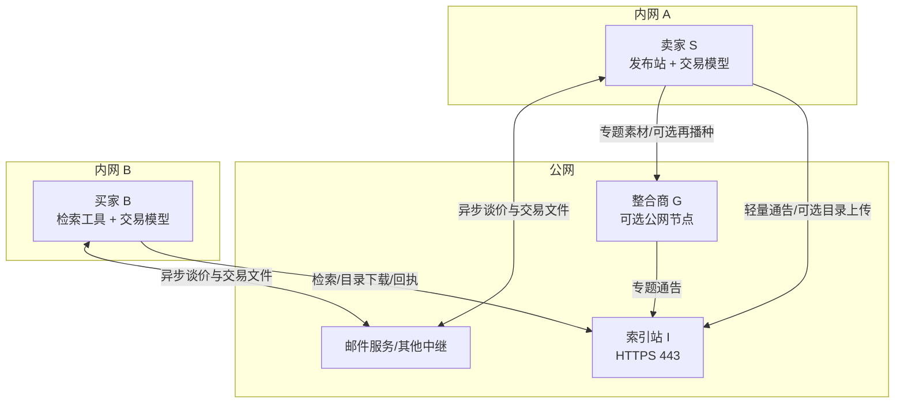

# Agent Native Trade 分布式试运行方案 v0.1

> 目标：在真实公网与两台 NAT 内网电脑之间，完成一次**全程使用虚构商品、虚构付款与虚构物流信息**的协议交易；验证协议不要求买卖双方拥有公网 IP，也不把 BT 穿透成功误判为交易协议成功。

## 1. 本轮要回答的问题

1. 卖家与买家都只允许主动出站连接时，商品能否被发布、检索并成交？
2. 索引站只保存轻量 `catalog card`、不保存完整目录时，检索是否仍可用？
3. 完整目录在卖家位于 NAT 后时，有哪些真实可用的获取路径？
4. 交易文件经邮件或其他中继异步交换后，双签、状态推进、回执和索引能否闭环？
5. 索引站或整合商重启、掉线、收到重复或篡改数据时，结果是否可预测？

本轮不验证真实支付、真实个人信息、真实物流履约，也不追求压测到服务不可用。

## 2. 角色与网络拓扑



建议机器分配：

| 节点 | 位置 | 是否需要公网入口 | 第一轮职责 |
| --- | --- | --- | --- |
| I | 公网服务器 | 是，只开放 HTTPS 443 | Station `indexer`、轻量索引、可选完整目录镜像、回执 |
| G | 公网服务器；第一轮可与 I 同机不同容器 | 可选 | Station `integrator`、专题目录；第二轮验证归档/再播种 |
| S | 电脑 A，普通家庭/办公网络 | 否 | Station `publisher`、卖家模型、卖家邮箱 |
| B | 电脑 B，另一条普通网络 | 否 | 买家模型、检索与交易工具、买家邮箱 |
| O | 可选电脑 C | 否 | 观察、抓日志、故障注入，不参与签名 |

硬约束：S、B 路由器不做端口映射，不开 UPnP，不用公网隧道；所有必要链路必须由它们主动发起。I 与 G 可以先共用一台廉价公网服务器，逻辑角色分开即可。

## 3. 两阶段策略

### 阶段 A：先验证协议闭环

- S 主动向 I 发送包含发布者公钥、已签 `LISTING_REF` 与 `catalog card` 的完整通告。
- I 不需要完整目录即可响应标签检索和 `GET /catalogs/:hash/card`。
- 为让第一次跨网测试稳定可复现，S 再主动把完整目录存档包 `PUT /catalogs/:hash` 到 I。该镜像是**可选降级路径**，不是发布或检索的前置条件。
- B 从 I 取得完整目录，之后通过邮件交换 DEAL、事件和回执文件。
- 付款使用 `test-voucher`；物流使用虚构单号；不使用真实资金、地址或商品。

### 阶段 B：验证分布式目录交付

- 删除 I 上的完整目录镜像，只保留轻量卡片。
- 依次测试 BT/DHT、G 再播种或 G 的公网归档路径。
- 如果 S 位于对称 NAT 后导致 BT 获取失败，应记录为“目录传输路径失败”，不应判定协议或轻量索引失败。
- 当前整合商能聚合 `LISTING_REF`，并可在成功取得目录时再播种；它还没有一个保证 NAT 卖家可主动上传的通用归档入口。若实测确认需要，后续最小增量应是 G 的受限 `PUT /catalogs/:hash` 或外部对象存储适配器，而不是让 S 暴露公网端口。

## 4. 假设交易

首轮使用“虚构同城空调清洗服务”：

| 字段 | 测试值 |
| --- | --- |
| 商品/服务 | 浦东新区空调清洗一次 |
| 数量 | 1 |
| 价格 | `12.34 TEST` |
| 支付 | `test-voucher`，不对应任何真实资产 |
| 履约 | 虚构上门时间与虚构服务单号 |
| 联系 | 两个专用测试邮箱 |
| 评价 | 买卖双方各一份已签 `TRADE_RECEIPT` |

它既覆盖本地服务场景，又不要求真实发货。等这个流程跑稳，再把同一套步骤换成“语言模型棉花娃娃套装预售”。

## 5. 准备清单

### 公网服务器 I/G

- 一个域名或两个子域名，例如 `index.example.com`、`topic.example.com`。
- TLS 证书；公网只开放 443，Station 端口仍绑定 `127.0.0.1`。
- 反向代理设置请求体上限、温和限流和访问日志。
- Docker Compose，持久卷有备份；系统时钟启用 NTP。
- 先用 `deploy/station/` 启动 indexer。G 可先不启动，或另用 integrator 配置启动。

### 卖家 S

- 克隆同一提交，安装依赖并跑 `bash tools/verify-all.sh`。
- 新建测试身份和专用数据目录；不得使用协议仓库内公开测试种子进行任何真实交易。
- 准备虚构目录，`metadata.tags` 至少包含 `浦东新区`、`空调清洗`、`本地服务`。
- `announce_to` 指向 I 的公网 HTTPS 地址。
- `public_base_url` 不得填写 S 的局域网地址；没有公共目录端点时留空或只把它视为本机调试地址。

### 买家 B

- 克隆同一提交并通过本地测试。
- 新建独立测试身份和专用数据目录。
- 配置 I 的检索地址、买家测试邮箱和卖家测试邮箱。

### 共同记录

- 生成一个 `run_id`，例如 `pilot-20260823-01`；所有日志、邮件主题和虚构交易备注都带该值。
- 四个角色分别记录 `agent_id`、公钥、提交 SHA、UTC 起止时间和日志文件哈希。
- 共享公钥，绝不共享 `.seed`、`.key`、邮箱口令或其他秘密。

## 6. 执行步骤与验收

### T0：基线与网络边界

1. I 启动后，从 S、B 分别访问 `/healthz`。
2. 从外网确认 S、B 没有 Station 监听端口可达。
3. S、B 分别发送和接收一封带 `run_id` 的测试邮件。

通过条件：S、B 只靠出站 HTTPS/SMTP/IMAP 即完成操作；I 的 Station 原始端口未直接暴露。

### T1：轻量发布与检索

1. S 启动 publisher，自动向 I 通告。
2. B 查询：

   ```text
   GET /catalogs?tag=浦东新区&tag=空调清洗
   ```

3. B 获取命中项的轻量卡片：

   ```text
   GET /catalogs/:hash/card
   ```

4. 在尚未上传完整目录时请求 `GET /catalogs/:hash`。

通过条件：标签检索命中，卡片中的哈希和签名关系有效；第 4 步允许返回 404，且不影响检索成功。I 的数据目录只出现 S 的公钥，不出现 S 的私钥。

### T2：确定性完整目录路径

1. S 由出站 HTTPS 将完整目录存档包 PUT 到 I。
2. B 从 I 下载，验证 manifest、文件哈希与 `LISTING_REF.catalog_hash`。
3. 停止 S 的 publisher，再次由 B 下载。

通过条件：上传和下载内容一致；S 离线后可选镜像仍可下载；镜像缺失时不会伪造空目录或错误内容。

### T3：异步谈价与双签 DEAL

1. B 根据目录中的联系方式发询价邮件。
2. S 返回报价和履约条件。
3. B 编译并签署 DEAL，将 JSON 作为附件发送给 S。
4. S 验证 body hash、买方签名、金额和条件，在同一 DEAL 上追加签名并回传。
5. 双方分别验证最终文件，确认 `object_id` 完全相同。

通过条件：邮件顺序可以异步，但最终 DEAL 双签、双端验签均为 `valid`；任何正文修改都会改变哈希并使旧签名失效。

### T4：虚构结算与履约状态

按合法状态链执行：

```text
DEAL_SIGNED → PAYMENT_REQUESTED → PAYMENT_CONFIRMED
→ FULFILLING → SHIPPED → DELIVERED → COMPLETED
```

- 结算使用 `test-voucher`。
- `SHIPPED` 在本地服务测试中解释为“服务人员已出发”，证据只放虚构服务单号。
- 每个事件文件经邮件同步给对方；对方验签后再推进本地状态。

通过条件：双方最终状态均为 `COMPLETED`；跳过 `DELIVERED` 直接完成会被拒绝；重复事件不会产生第二笔交易。

### T5：公开回执与离线快照

1. B、S 各自创建一份签名回执并通过出站 HTTPS 提交 I。
2. 查询双方信誉视图和相关检索结果。
3. 从 I 导出带分离签名的快照，在 O 或 B 上离线验签。

通过条件：两份回执均能追溯到同一 DEAL；篡改回执被拒；快照在 I 下线后仍可离线验证。

### T6：整合商路径

1. G 以 S 的 `LISTING_REF` 为 member 生成“浦东本地服务”专题。
2. G 将自己的轻量通告发给 I，B 通过专题标签检索。
3. 关闭 G 后再次查询 I。
4. 阶段 B 再删除 I 的完整镜像，单独测试 G 再播种/归档是否能让 B 取得完整目录。

通过条件：专题和原始商家是两个可验证对象，I 不需要 G 在线即可保留最后一次有效索引；目录交付失败时应明确区分“卡片可检索”和“完整内容不可取得”。

## 7. 故障与对抗用例

| 编号 | 操作 | 期望结果 |
| --- | --- | --- |
| F1 | 重复发送同一通告 10 次 | 幂等，不产生 10 个商品 |
| F2 | 改一字节 catalog card | 哈希或签名验证失败 |
| F3 | 同一 `agent_id` 换公钥重发 | TOFU 冲突，返回 409 或明确拒绝 |
| F4 | 先发裸 `LISTING_REF`，I 未知其公钥 | `unknown_signer`；随后完整通告可自举 |
| F5 | I 重启 | 索引、公钥和回执仍在 |
| F6 | S 发布后立即离线 | 轻量搜索仍在；完整目录是否可用取决于镜像/再播种 |
| F7 | 邮件重复、乱序投递事件 | 已处理对象可识别；非法状态迁移被拒 |
| F8 | G 离线 | 原始商家索引不受影响，专题保留最后有效版本 |
| F9 | 请求体超过 512 KiB | 公共端点返回 413，不进入索引 |
| F10 | 删除 I 的完整目录镜像 | 卡片查询继续成功，完整目录明确 404 或走其他引用 |

## 8. 小规模容量测试

廉价服务器第一轮只做温和容量验证：

1. 由多台电脑合计发布 100、1,000 份不同卡片，逐级执行，不做突发洪泛。
2. 查询固定标签、冷门标签和不存在的标签各 100 次。
3. 记录 HTTP 请求数、入站/出站字节、磁盘、内存、CPU、错误率和 p50/p95 延迟。
4. 反向代理从每 IP 低并发限流开始，根据日志调整；不要用测试流量模拟 DDoS。

初始通过线：无数据损坏、无未处理异常、重启后数量一致；1,000 卡片时 p95 查询小于 2 秒。性能不达标可以优化，但签名、哈希和身份冲突检查不能因压测而关闭。

## 9. 最终验收表

- [ ] S、B 均无公网 IP、无入站端口，仍完成发布/检索/交易/回执。
- [ ] I 不镜像完整目录时，轻量检索照常工作。
- [ ] 第一轮通过可选 HTTP 镜像稳定取得完整目录。
- [ ] 第二轮分别记录 BT、G 再播种/归档的真实可达性，不掩盖 NAT 失败。
- [ ] DEAL 双签且两端 `object_id` 一致，所有事件和回执验签有效。
- [ ] 全状态链到达 `COMPLETED`，双方回执进入 I 并可离线验证。
- [ ] I/G 只持有其他角色公钥，不持有其他角色私钥。
- [ ] 重复、篡改、身份冲突、乱序和重启测试结果符合预期。
- [ ] 结果包不包含任何真实资金、真实地址、真实凭证或私钥。

## 10. 结果包

每台机器保留自己的原始日志，最终只汇总：

```text
pilot-<run_id>/
├── topology.json
├── versions.json
├── public-keys/
├── catalog-card.json
├── listing-ref.json
├── deal.json
├── events/
├── receipts/
├── indexer-export/
├── metrics/
└── report.md
```

`report.md` 对 T0–T6、F1–F10 逐项写 PASS / FAIL / BLOCKED，并把“协议失败”“传输路径失败”“部署配置失败”分开记录。任何种子、私钥、邮箱口令和真实个人信息都不得进入结果包或 Git。
